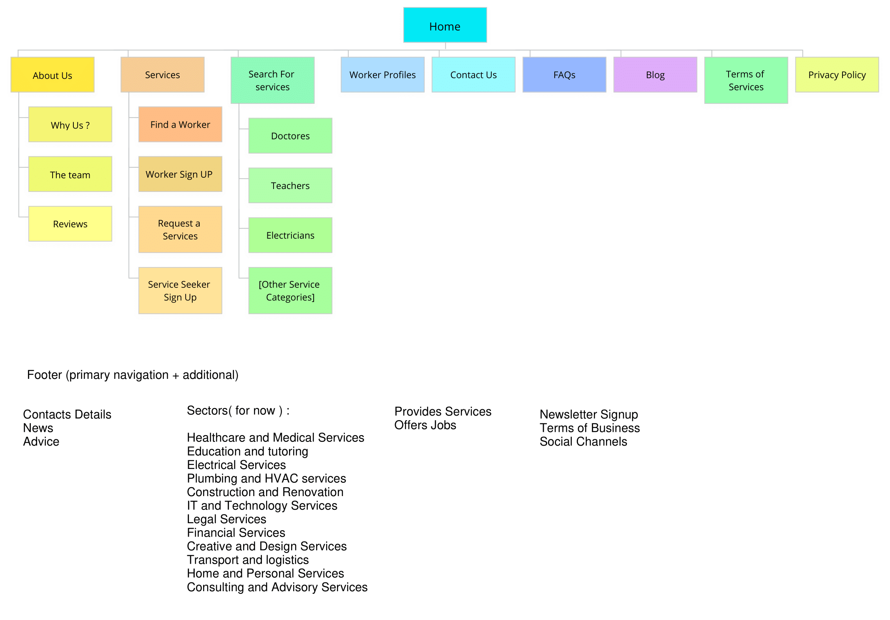

# Project Name: Dziri Serve

# Team members: Djelili Imene Fatma / Bachir Imene / Mereddef Amira

# 1. Who is this website for?

## 1.1 Tergeted individuals:
   
### What is the age range of your target audience?

   The website targets a broad age range, primarily focusing on working-age individuals, aged 18 to 55, for workers. For clients, the audience is even broader, encompassing young adults (18-35), middle-aged individuals (36-55), and potentially seniors (55+). However, seniors may represent a smaller portion of our user base due to lower internet adoption rates in this age group.

### Will your site appeal to more women or men? What is the mix?

   While the gender mix may fluctuate, it is our aim to maintain a balanced representation to ensure equal appeal to both men and women. This approach aligns with the diverse range of services offered on the platform, which are not limited by gender.
   
### Which country do your visitors live in?

   Initially, our website is tailored for Algerian clients, but we envision the possibility of expanding its reach in future projects to cater to a broader audience.

### Do they live in urban or rural areas?

   The platform is designed to accommodate users from both urban and rural areas, with a slightly higher focus on urban users due to their greater internet accessibility and density.

### What is the average income of visitors?

   The website's target audience encompasses individuals with a diverse range of income levels, including both low-income workers seeking opportunities and middle-class clients in search of services.

### What level of education do they have?

   Our target audience encompasses individuals with diverse educational backgrounds. For workers, this includes those with vocational training certificates as well as those formal without vocational training. Additionally, our audience consists of individuals ranging from high school graduates to those with advanced degrees .
   
### What is their occupation?

  Our platform caters to a wide range of occupations, accommodating both clients and workers:
Clients: Our client audience spans various occupations, from homeowners seeking construction services to companies in need of specialized contractors. We serve a diverse group of clients.
Workers: Workers using our platform come from various occupational backgrounds, including skilled trades such as carpentry, plumbing, and electrical work. We also connect job seekers from a broad spectrum of professions, including students, professionals, and individuals seeking part-time or freelance opportunities.
### How many hours do they work per week?
   Workers using our platform often have flexible work schedules, with a focus on part-time or freelance roles, making it an attractive option for those seeking supplementary income.
   
### How often do they use the web?

   Frequency of web use may vary among our audiences, but we expect them to access it when they need services or opportunities.
   
### What kind of device do they use to access the web?

   Our audience is likely to access the website using a mix of devices, including smartphones, tablets, and desktop computers ...
   
## 1.2 Tergeted companies:

### What is the size of the company or relevant department?
   Our platform serves a diverse range of companies, including small businesses, startups, and medium-sized enterprises.

### What is the position of people in the company who visit your site?
Visitors to our site typically encompass business owners and department heads responsible for hiring and project management. In this context, they assume the role of "clients."

### Will visitors be using the site for themselves or for someone else?
Visitors to our site may seek services or job opportunities for their companies. For instance, an HR manager might explore contractor options for a company project. 

### How large is the budget they control?
The budgetary control of our site's visitors varies significantly, depending on the nature and scope of their projects or service needs. These budgets can range from modest allocations for local services to substantial funds for large-scale corporate endeavors. Our platform is thoughtfully designed to accommodate this diversity in budget control.  

# 2. Why people visit this website?

General Answer before the key motivations : 

People visit the website to connect with skilled workers or find specific services they need within the Algerian community.

## 2.1 Key motivations:

### Are they looking for general entertainment or do they need to achieve a specific goal?

Most of the users of our platform need to achieve a specific goal: 

Visitors are looking to either offer their services as skilled workers or find specific services they need.
The primary goal for both groups is to connect with each other within the Algerian community for various services.
For Workers: 
 They are motivated by the opportunity to showcase their skills, qualifications, and availability to potential clients.
For Services Seekers:
 They are motivated by the need to find specific services like doctors, teachers, electricians, etc., to address their individual needs. Their goal is often personal and practical, as they require assistance with specific tasks or services.

### If there is a specific goal, is it a personal or professional one?

Yes, There are specific goals.
The goals can be categorized as both professional and personal, depending on whether we are considering the perspective of workers or services seekers:
For Workers:
1.Finding Work Oppotunities: 
Professional: Workers want to secure job opportunities, which is a professional goal.
For Services Seekers:
1.Specific Service Searches: 
Personal: They might be searching for particular type of service or skilled worker that matches their requirements.

### Do they see spending time on this activity as essential or a luxury?
The perception of whether spending time on "DziriServe" platform is viewed as essential or a luxury depends on the individual user's specific circumstances and needs as it will be more clearer in the following : 

1.Essential: 
For some users, particularly those in urgent need of specific services or workers seeking job opportunities, using the platform may be considered essential. They rely on the platform to connect with skilled workers or find services that are crucial to their immediate needs. For them, the platform serves as a vital resource.

2.luxury:
Other users may view the platform as a luxury, especially if they have the flexibility to choose when and how they use it. This group may view the platform as a convenient and valuable resource, but not necessarily a necessity for their day-to-day activities.

## 2.2 Specific goals:

### Do they want general information / research (such as background on a topic / company), or are they after something specific (such as a particular fact or information on a product)?

In generaly most of the users of this platform have specific factfinding missions, they might have a more focused objective. They are after particular facts or information, which could be related to a product, service, or individual worker's qualifications. Their goal is to find precise, targeted details to meet their immediate needs.
Although, that does not mean that the other categoy of users who want general information does not exist, because other users may visit the platform with the intention of gathering general information or conducting research. This could involve seeking background information about a particular topic. They may be interested in gaining a comprehensive understanding before making any specific decisions.

### Are they already familiar with the service or product you offer or need to be introduced to it?

Some users may be entirely new to the concept and may require an introduction to understand how the platform works and how it can benefit them. They may need information on the process of finding services or offering their skills.Other users may already be familiar with the concept of connecting skilled workers with service seekers, and in all cases we have to consider both categories of the users.

### Are they looking for time sensitive information, such as the latest news or updates on a particular topic?

THe answer for this question would be yes, some users may be seeking time-sensitive information, such as the latest news or updates on specific topics for example the available jobs on the platforms or the newest servis that are provided or the new workers that joined us.

### Do they want to discover information about a specific product or service to help them decide whether to buy it or not?

Yes, some users may visit the platform with the intention of gathering information about specific products or services to help them make informed decisions about whether to proceed with a purchase. These users are in the process of conducting research and evaluation to ensure that the product or service aligns with their needs and preferences.

### Do they need to contact you? If so, can they visit in person (which might require opening hours and a map)? Or might they need email or telephone contact details?

Yes, some users may have a need to contact the platform for inquiries, support, feedback, or specific requests and especially those who are looking for job offers.Also, for the contact preferences most of the contact between us and the users will be using the email address or the telephone.
For now, visit in persone and opening hours may not be necessary, but maybe in the future there will be an openings hours to clarify more for the users.

# 3. What visitors are trying to achieve?

## Key tasks and motivations:
Visitors to dziriserve fall into two main categories: clients and workers. Each group has distinct goals and objectives when they visit our site:

** Clients:

- Find Services: Clients visit dziriserve to find the specific services they need. Whether it's building construction, learning opportunities, or any other service.
- Ease of use: Customers prefer to use our website to request services because of its ease of use. They do not have to move around or make an effort. They can just request the service from their homes.
- Discover Services: Visitors explore the platform to discover various services offered by professionals.

** Workers:

- Find Job Opportunities: Workers who visit dziriserve are seeking job opportunities in their respective fields. 
- Connect with Peers: Visitors use HERAFY to connect with professionals in their industry, share knowledge, and build professional relationships.
- Enhance Reputation: They use the platform to build a positive online reputation and gain credibility in their industry.

## List of reasons why people visit the HERAFY website:
* Job Searching
* Finding Freelance Work
* Hiring Skilled Workers
* Posting Job Listings
* Networking and Professional Connections
* Discovering Various Services
* Project Management and Collaboration
# 4. What information visitors need to acheive their goals?

### Will visitors be familiar with your subject area / brand or do you need to introduce yourself?

Some visitors as we mentioned before in question 2 that they  may be entirely new to the concept and may require an introduction to understand how the platform works, because as we know , in order to  find someone to do a job such as repairing electricity or drainage pipes ,requires personal relationship with a worker ,but we overcome this problem by offering people who are doing such kind of jobs and those who are such as skilled workers with intention of facilitate people’s life. So to reach this goal, we are obliged to introduce ourselves to both client and worker.

### Will they be familiar with the product / service / information you are covering or do they need background information on it?

 visitors may have varying levels of familiarity with the platform's services. Some may be familiar with the concept of connecting skilled workers with service seekers, while others may need additional background information to fully grasp how the platform operates and how it can benefit them.
 Therefore, in both cases we are going to introduce our platform for all cases to make it easy for any category and more simple to understand and being familiar with the concept of connecting skilled workers with services.
 
### What are the most important features of what you are offering?

The most important features of the our platform "Dziri Serve" include:

•	Our website will be open 24/7 in case of any emergency.
•	The worker works only when she/he is free.
•	A young worker will not be obliged to work for another boss, she/he starts with us.
•	A large amount of work chances are offered.
•	The client can distinguish between a good worker and the one who is not good in doing his/her job and this is going to be through allowing service seekers to provide feedback on the quality of service received, in order to enhancing trust and transparency.
•	The worker can post it creations on its dziriServe profile.
•	Our website offers also for women who work from their houses to enlarge their projects.
• User Authentication: Allowing workers to create profiles and service seekers to search without registration, ensuring accessibility for all users.

### What is special about what you offer that differentiates you from other sites that offer something similar?

The unique selling points of our website " Dziri Serve "  include:

•	We offer an easy way for our workers to find jobs and also services for clients.
•	We offer good prices for clients and code promo for our loyal clients
•	We offer a huge number of work chances for our works.
•	Our services covers a lot of fields (education, food, crafts, ...).
•	Our service policy is safe and fair, as well as comprehensive to all parts of the country.
•	Our website offers trustful works.
•  Workers can create customized profiles to highlight their specific skills, qualifications, and availability, providing a personalized touch.
•  The messaging system provides a secure environment for users to discuss job details, ensuring privacy and confidentiality.
•The platform allows service seekers to search without registration, ensuring a seamless and hassle-free experience.

### Once people have achieved the goal that sent them to your site, are there common questions people ask about this subject area?

Yes, once users have achieved their initial goal on our website, they may have common follow-up questions related to the subject area. These could include inquiries about:

•	Does the worker come in time as mentioned in the website?
•	Is the service offered by the worker good enough or not?
•	Is it trustable?
• Users may have questions about payment methods, rates, and compensation for services rendered.
• They may inquire about the possibility of offering or finding additional services beyond their initial goal.
• Users may be interested in learning more about the platform's features, any recent updates, or upcoming enhancements.

# 5. How often will people visit the website?

Since we have two categories of people who will visit our website, therefore we distinguish two cases :

Clients:
 They will visit periodically when they require specific services.
Workers:
 They will access the platform more regularly to offer their services ( once they are available ) , to let clients know that they are available for that specific service.

# 6. Site maps:

Dziri Serve site map : 

